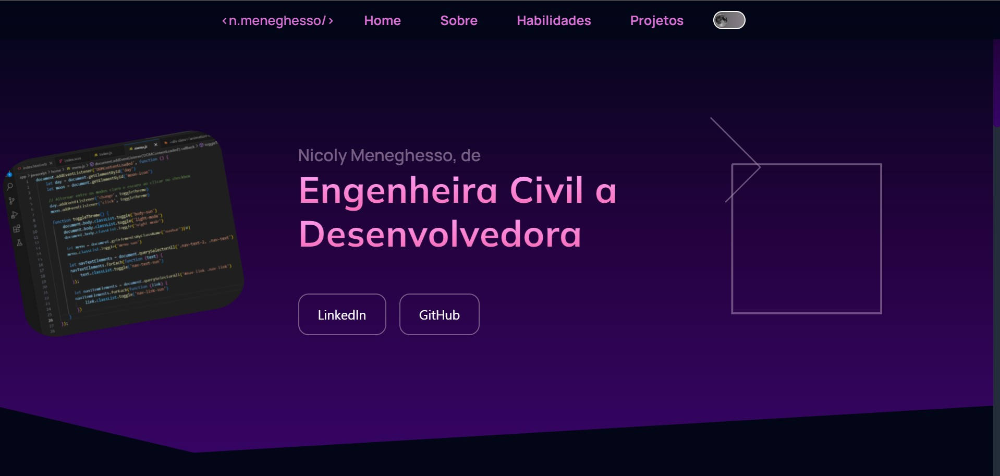
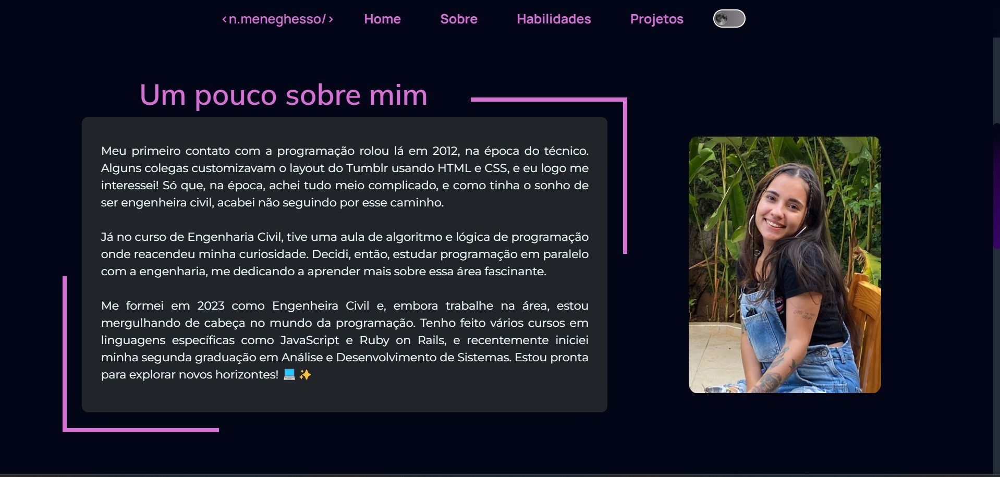
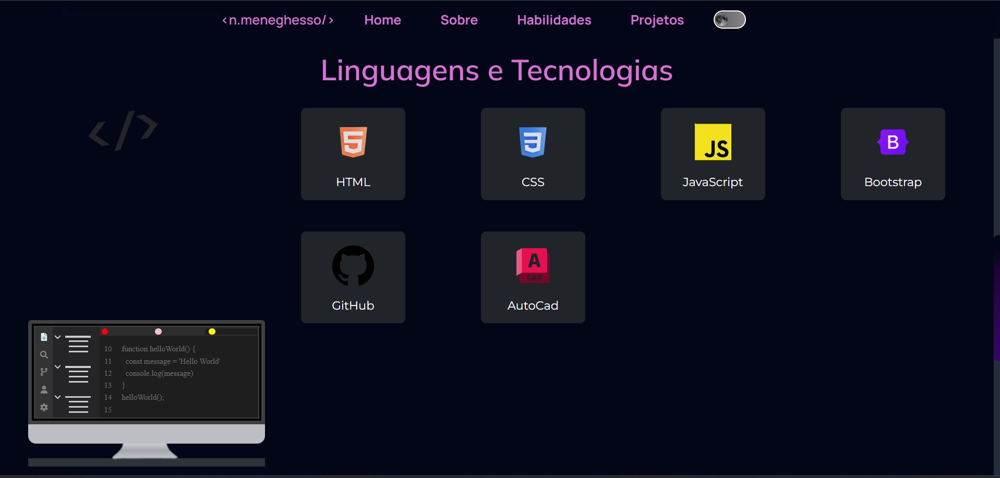
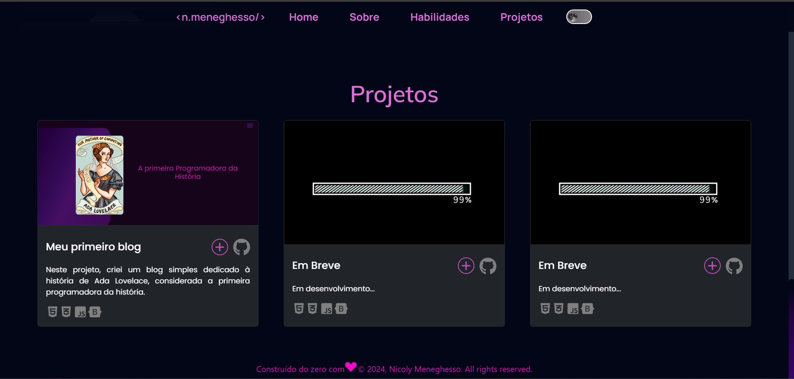
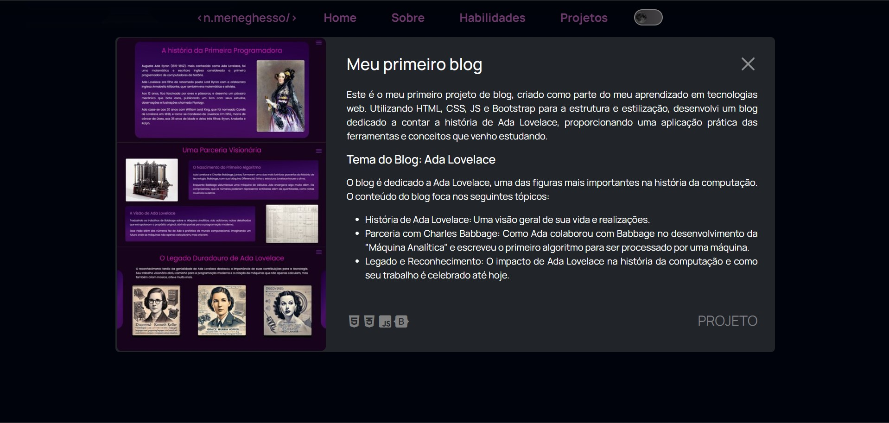

# Portfólio

Este portfólio foi o meu primeiro grande projeto, no qual desenvolvi diversas versões do front-end até chegar ao resultado final. Durante o processo, aprimorei meus conhecimentos em HTML, SCSS e JavaScript, além de iniciar meus estudos em Ruby on Rails. Neste projeto, implementei o modo claro e escuro, além de aplicar meus primeiros estudos em banco de dados, proporcionando um contato inicial com a gestão e manipulação de dados dentro de uma aplicação real.

## Estrutura e Funcionalidades

* Sobre Mim: Uma breve introdução sobre minha trajetória e motivações na área de desenvolvimento.
* Linguagens e Tecnologias: Apresenta as principais ferramentas e tecnologias que domino, com exemplos práticos e demonstrações das minhas habilidades técnicas.
* Projetos: Exibe uma visão detalhada de cada projeto, com links e descrições para facilitar a navegação e o entendimento.
* Layout Responsivo: O design foi projetado para ser adaptável a diferentes dispositivos, garantindo uma experiência consistente em desktops, tablets e smartphones.

## Tecnologias Utilizadas

* Ruby on Rails
* HTML5
* CSS3
* JavaScript
* Bootstrap

